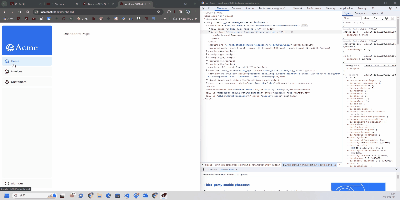

# ページ間の移動
## `<Link>`コンポーネント
`<Link>`コンポーネントを使うことで、遷移時にページ全体が更新されずに、変更部分だけが更新される。(図1)
これによって高速にページ遷移が出来てパフォーマンスが向上する。



### どうなってるの？
Next.jsは、ユーザーのナビゲーション体験を向上させるために、自動的なコード分割とプリフェッチ（事前読み込み）を提供しています。これは、従来のReact SPA（シングルページアプリケーション）とは異なり、ブラウザが初回ロード時にアプリケーションの全コードを読み込むのではなく、ルート（ページ）ごとにコードを分割して読み込む方式です。

ルートごとにコードを分割することにより、ページは独立して扱われます。これにより、特定のページでエラーが発生しても、アプリケーションの他の部分は正常に機能し続けることができます。

さらに、本番環境では、`<Link>`` コンポーネントがブラウザのビューポートに表示されると、Next.jsは自動的にリンク先ルートのコードをバックグラウンドでプリフェッチします。その結果、ユーザーがリンクをクリックする時点で、目的のページのコードは既にバックグラウンドで読み込まれており、ページ遷移がほぼ瞬時に感じられるようになります。

## アクティブ表示
現在どのページにいるのかをアクティブリンクで表示させる。URLから今見ているページを`usePathname()`で取得して実装する。

### 実装
`/app/ui/dashboard/nav-links.tsx`で`usePathname()`を使用するために`'use client';`して、
```ts
import { usePathname } from 'next/navigation';
```
して、
```ts
const pathname = usePathname();
```
でパスを取得して
```jsx
<Link
    key={link.name}
    href={link.href}
    className={clsx(
            'flex h-[48px] grow items-center justify-center gap-2 rounded-md bg-gray-50 p-3 text-sm font-medium hover:bg-sky-100 hover:text-blue-600 md:flex-none md:justify-start md:p-2 md:px-3',
                {
                    'bg-sky-100 text-blue-600': pathname === link.href, // pathnameとlink.hrefが一致するときは青色にする
                },
        )
    }
>
```
